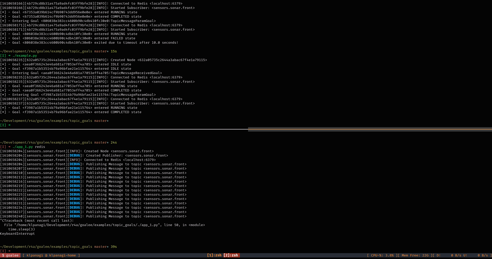
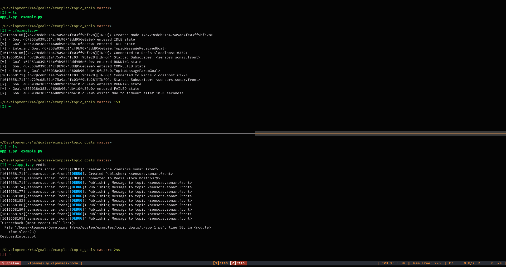

This is a simple example that illustrates the usage of
**TopicMessageReceivedGoal** and **TopicMessageParamGoal*** classes. Local Redis
instance is used as the communication middleware.

The Target defines two Goals. The first is a ***TopicMessageReceivedGoal*** for
topic `sensors.sonar.front` and the second goal is a
***TopicMessageParamGoal** for topic `sensors.sonar.front` with the following
condition (declared as a lambda function).

```
condition = lambda msg: True if msg['range'] > 5 else False
```

To run the example, simply run the `goal_checker.py` and `app.py` executables in
separate terminals.



